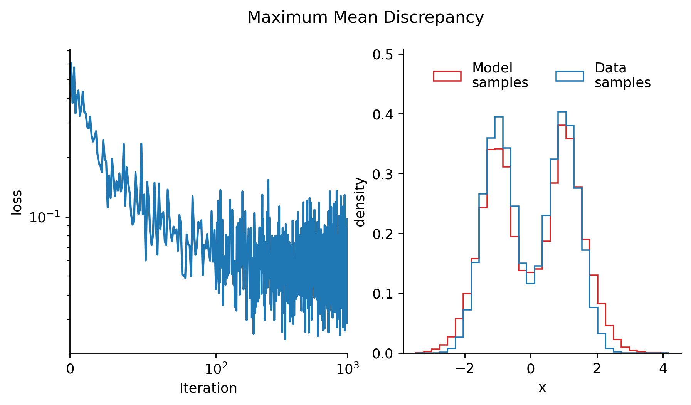
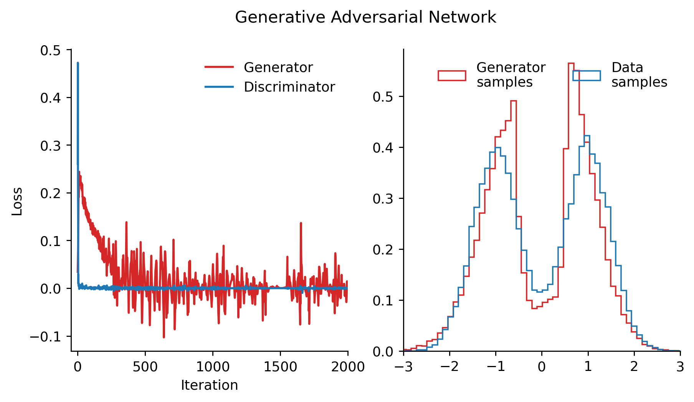
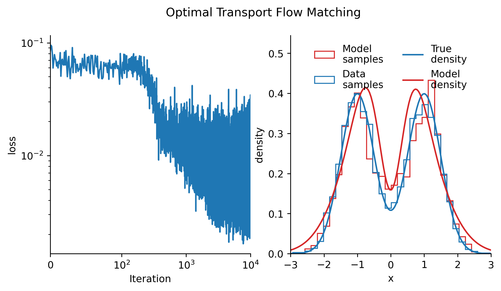
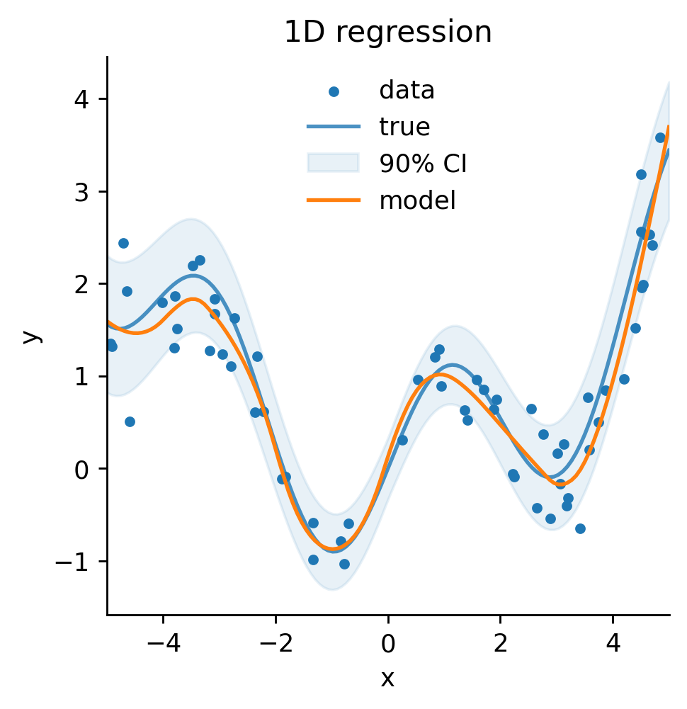

\vspace{1em}
_Implementation is available at [$\texttt{github.com/pwolle/seli}$](https://github.com/pwolle/seli). Project motivation and details are discussed after the technical overview._

# Introduction

Inferring a probabilistic sampling procedure from observational data is a fundamental challenge in machine learning and statistics. Given a finite set of samples, the goal is to learn a procedure that can generate new samples that follow the same underlying probability distribution. This task is particularly challenging because the true data distribution is typically unknown and must be inferred solely from the available samples. This task is also called _generative modeling_, which indicates that the central goal is typically not to learn a description of the underlying probability distribution, but rather a procedure that can generate new samples from the distribution.

Generative models thereby implicitly represent a probability distribution over new samples, with the aim of being close to the true data distribution, i.e. having similar statistical, perceptual, and semantic properties. More formally, given a dataset $\mathcal{D} = \{x_i\}_{i=1}^N$ where $x_i \sim p_{\text{data}}(x)$ are typically independent and identically distributed samples from an unknown true data distribution $p_{\text{data}}: \mathcal{X} \rightarrow \mathbb{R}^+$, the objective is to approximate $p_{\text{data}}$ with a model distribution $p_\theta$ parameterized by some $\theta \in \Theta$, where $\Theta$ is called the parameter space.

The quality of a generative model is typically assessed by its ability to: (1) generate individual samples that are indistinguishable from real data, (2) generate diverse samples with similar statistical properties, (3) provide efficient sampling procedures, and if applicable (4) accurately estimate the likelihood of new samples. These objectives often present competing demands, leading to various approaches with different trade-offs.

Traditional generative modeling techniques such as mixture models and hidden Markov models have been well-studied in statistical literature [@bishop2007; @hastie2009elements; @murphy2012machine]. However, the advent of modern machine learning techniques has revolutionized this field by enabling more flexible and expressive models capable of capturing more intricate data distributions. Modern deep generative models leverage neural networks as function approximators to parameterize arbitrary transformations to imply more complicated probability distributions [@rezende2016variationalinferencenormalizingflows].

# Motivation

The pursuit of generative modeling is motivated by several key scientific and practical considerations. Understanding how to model probability distributions lies at the heart of statistical learning theory and connects deeply to fundamental questions in information theory, statistical physics, and computational neuroscience. From a practical perspective, generative models serve numerous important functions:

**Data synthesis**: Generating synthetic data that preserves the statistical properties of real data is valuable when real data is scarce, expensive to collect, or subject to privacy concerns. In healthcare, finance, and other sensitive domains, synthetic data generation enables analytics and algorithm development without exposing protected information [@schlegel2025generatingsyntheticdataformal].

**Representation learning**: The process of learning to generate data often requires models to discover compact, meaningful representations of high-dimensional data. These learned representations frequently capture semantically meaningful features that can be transferred to downstream tasks. Generative models are particularly effective at this, as they can be directly applied large datasets without the supervision of human-annotated labels [@radford2018learning].

**Scientific discovery**: By learning the distribution of existing data (e.g., protein structures, molecular configurations, astronomical observations), generative models can suggest novel configurations with desired properties, accelerating discovery in fields like drug design or materials science [@jumper2021highly].

**Compression**: Understanding the structure of data distributions enables more efficient encoding and storage of information. By identifying regularities in data, compression algorithms can assign fewer bits to common patterns and more bits to rare features. Generative models can fill in the discarded parts of compressed data, with realistic patterns that are perceptually equivalent to the original data [@shannon1948].

**Distribution estimation**: Many statistical inference problems require estimating probability densities from samples. Generative modeling provides flexible approaches to density estimation beyond traditional parametric methods. These density estimators can be used for tasks such as anomaly detection, where the goal is to identify data points that deviate from the expected distribution [@nachman2020anomaly].

**Simulation**: In domains where running physical experiments is costly, generative models trained on existing data can serve as efficient simulators for counterfactual reasoning and scenario exploration. This is particularly useful if there is a combinatorial explosion in the number of necessary experiments, in such cases generative models may generalize to adjacent, unseen configurations and thus decrease the number of experiments required [@Das2021accelerated].

**Inverse problems**: Generative models excel at recovering original signals from corrupted or incomplete measurements—a challenge known as inverse problems. By learning what typical uncorrupted data looks like, these models can reconstruct missing information with remarkable accuracy. Applications include removing noise from photos, enhancing image resolution, filling in missing parts of signals, and reconstructing medical images from limited scan data. This capability represents a significant improvement over traditional techniques, particularly when dealing with complex real-world data [@duff2023regularising].

# Function Approximation
Functions are mappings between two sets which have a fixed output for each input. This problem is conceptually simpler when compared to generative modeling, as it is deterministic, performance is straighforward to assess and it stays at the level of individual points, not distributions. Function approximation will later be used as the core building block for generative modeling.

### Definition 1 (Function Approximation) {.unnumbered}
Let $(X, \Sigma_X)$ and $(Y, \Sigma_Y)$ be metric measurable spaces, and consider a function $f: X \rightarrow Y$ and a parameterized family of functions $\mathcal{F} = \{f_\theta: X \rightarrow Y \mid \theta \in \Theta\}$, where $\Theta$ is the parameter space. The function approximation problem is to find parameters $\theta^* \in \Theta$ such that $f_{\theta^*}$ is "close" to $f$ according to some distance metric $d: Y^X \times Y^X \rightarrow \mathbb{R}^+$.
$$
f_{\theta^*} = \arg\min_{\theta \in \Theta} d(f, f_\theta)
$$
Note that the minimum does not necessarily exist, and even if it does, it might not be unique. In practice, we often settle for a suboptimal solution, or a solution that is close to the minimum, i.e. identifying a close to optimal solution for some $\varepsilon > 0$ is considered a success
$$
d(f, f_{\theta^*}) \leq \inf_{\theta \in \Theta} d(f, f_\theta) + \varepsilon\,.
$$

### Definition 2 (Approximation Error) {.unnumbered}
The approximation error $d(f, f_{\theta^*}) = d(f, f_{\theta^*})$, denoting a measure of how close $f_{\theta^*}$ is to $f$, may be defined in different ways depending on the problem at hand. Here are some relevant examples:
$$
\begin{aligned}
d_{\infty}(f, g) &= \sup_{x \in X} |f(x) - g(x)| \\
d_p(f, g) &= \left(\int_X |f(x) - g(x)|^p \text{d}\mu(x)\right)^{1/p} \\
\end{aligned}
$$
where $\mu$ is a (probability measure on $X$. The first distance is the uniform distance, which is the maximum difference between the two functions over the domain $X$. The second $L_p$ distance is integrated with respect to a probability measure, so two functions may be different on sets of small measure without contributing much to the total distance.

### Definition 3 (Universal Approximation) {.unnumbered}
A family of functions $\mathcal{F}$ is said to be universal if for any function $f: X \rightarrow Y$ and any $\varepsilon > 0$, there exists a function $f_\theta \in \mathcal{F}$ such that $d(f, f_\theta) < \varepsilon$. Some example of universal families of functions are:
- Piecewise linear functions on a grid are universal for the both the uniform and the $L_p$ distances.
- Neural networks with a single hidden layer are universal for the $L_p$ distance and uniform on compact sets.

## Neural Networks

Neural networks form the backbone of modern deep learning approaches to generative modeling. At their core, they are parametric function approximators inspired by biological neural systems, capable of expressing complex, non-linear mappings between finite-dimensional vector spaces.

### Definition 4 (Neural Network) {.unnumbered}
A feedforward neural network with $L$ layers is a composition of functions $f_{\theta} = f^{(L)}_{\theta_L} \circ f^{(L-1)}_{\theta_{L-1}} \circ \cdots \circ f^{(1)}_{\theta_1}$, where each $f^{(l)}_{\theta_l}: \mathbb{R}^{n_{l-1}} \rightarrow \mathbb{R}^{n_l}$ is a layer parameterized by $\theta_l$, mapping from $n_{l-1}$-dimensional space to $n_l$-dimensional space. The family of all possible neural networks $\mathcal{F}_{\text{NN}} = \{f_{\theta} \mid \theta \in \Theta\}$ can then be indexed by the parameters $\theta = (\theta_1, \theta_2, \cdots, \theta_L) \in \Theta = \mathbb{R}^{n_1 \times n_2} \times \mathbb{R}^{n_2 \times n_3} \times \cdots \times \mathbb{R}^{n_{L-1} \times n_L}$. The most common form of neural network layer is the fully connected (or dense) layer, defined as:
$$
f^{(l)}_{\theta_l}(x) = \sigma(W^{(l)} x + b^{(l)})\,,
$$
where $\theta_l = \{W^{(l)}, b^{(l)}\}$ consists of a weight matrix $W^{(l)} \in \mathbb{R}^{n_l \times n_{l-1}}$ and a bias vector $b^{(l)} \in \mathbb{R}^{n_l}$. The function $\sigma: \mathbb{R} \rightarrow \mathbb{R}$ is a non-linear activation function applied element-wise. A common and simple choice for the activation function is the ReLU function, defined as [@agarap2019relu]:
$$
\text{ReLU}(x) = \max(0, x)\,.
$$
However many similar functions can be used as activation functions as long as they are non-linear and differentiable almost everywhere, a modern example is the GELU function, which is defines as $GELU(x) = x \cdot \Phi(x)$, where $\Phi$ is the cumulative distribution function of the standard normal distribution [@hendrycks2023gelu]. Which functions perform better is theoretically not well understood, so it is largely an empirical question, as is the choice of the number of layers and the number of neurons in each layer.

### Expressivity and Universal Approximation

The theoretical foundation for using neural networks as function approximators is provided by the Universal Approximation Theorem, which states that a feedforward network with a single hidden layer containing a finite number of neurons can approximate any continuous function on compact subsets of $\mathbb{R}^n$ arbitrarily well, under mild assumptions about the activation function [@cybenko1989approximation; @hornik1991approximation].

More formally, for any continuous function $f: [0,1]^n \rightarrow \mathbb{R}$ and any $\varepsilon > 0$, there exists a single-layer neural network $f_\theta$ such that:

$$\sup_{x \in [0,1]^n} |f(x) - f_\theta(x)| < \varepsilon$$

In practice, deeper networks (those with more layers) have been found to be more parameter-efficient and easier to train for approximating highly complex functions, leading to the development of deep learning. The depth of a neural network provides a hierarchical representation learning capability, where each layer can learn progressively more abstract features of the input data.

While the simple feedforward architecture is flexible enough to be able to approximate most real-world relevant functions, the setup of modern neural networks is typically more complex to adress a range of practical concerns to ease the process of finding suitable parameters, since the vector space $\Theta=\mathbb{R}^n$ is typically very high-dimensional (in the order of millions to trillions of dimensions) and the set of optimal parameters is typically an algebraic variety of much lower, not well known number of dimensions [@watanabe2001algebraic].

An important caveat here is also that universal approximation is not sufficient for good performance as many classes of functions are universal approximators (i.e. polynomials) but may not be useful for a specific task. Furthermore, being universal approximators is also not necessary for good performance in practice, as graph neural networks have been shown to not be universal approximators on the set of functions on graphs, but still perform well on a range of graph related tasks [@xu2019gnn].

## Optimizers

Neural networks are typically trained through gradient-based optimization methods that minimize a loss function $\mathcal{L}(\theta)$, which measures the discrepancy between the network's output and desired output. The parameters $\theta$ are iteratively updated using the gradient information of the loss function on a batch of data [@rumelhart1986learning].
$$
\nabla_\theta \mathcal{L}(\theta) = \nabla_\theta \sum_{i=1}^N \mathcal{L}(x_i, f_\theta(x_i))\,,
$$
where $\mathcal{L}$ is a loss function, $x_i$ are samples from the dataset and $f_\theta$ is the neural network parameterized by $\theta$.


### Stochastic Gradient Descent (SGD)

Stochastic Gradient Descent uses the gradient on the batch of samples to approximate the full gradient descent update, which takes steps in the direction of the negative gradient, i.e. the direction of steepest descent given by a linear approximation of the loss function [@robbins1951stochastic]:
$$
\theta_{t+1} = \theta_t - \eta \nabla_\theta \mathcal{L}(\theta_t)\,.
$$
This makes each iteration much faster than full gradient descent and introduces noise that can help escape shallow local minima. The gradient is scaled by the learning rate $\eta$ and the update is applied to the parameters $\theta$. SGD is guaranteed to converge to a local minimum of the loss function under certain conditions, such as when the loss function is convex, the variance of the gradient is bounded and the learning rate goes sufficiently slow to zero [@bottou1998online].

### Momentum-Based Methods

Momentum methods incorporate information from past gradients to accelerate convergence, particularly in regions where the gradient is small but consistent in direction:

**Classical Momentum:**
$$
\begin{aligned}
v_{t+1} &= \gamma v_t + \eta \nabla_\theta \mathcal{L}(\theta_t) \\
\theta_{t+1} &= \theta_t - v_{t+1}
\end{aligned}
$$
where $\gamma \in [0, 1)$ is the momentum coefficient controlling how much past gradients influence the current update [@polyak1964some].

**Nesterov Accelerated Gradient (NAG):**
$$
\begin{aligned}
v_{t+1} &= \gamma v_t + \eta \nabla_\theta \mathcal{L}(\theta_t - \gamma v_t) \\
\theta_{t+1} &= \theta_t - v_{t+1}
\end{aligned}
$$
NAG computes the gradient at the "lookahead" position $\theta_t - \gamma v_t$, providing a more accurate update direction [@nesterov1983method].

### Adaptive Methods

Adaptive methods adjust the learning rate for each parameter based on the history of gradients, addressing the challenge of selecting appropriate learning rates.

**Adam** (Adaptive Moment Estimation) combines momentum with adaptive learning rates by maintaining exponentially decaying averages of both past gradients and squared gradients:
$$
\begin{aligned}
m_t &= \beta_1 m_{t-1} + (1 - \beta_1) \nabla_\theta \mathcal{L}(\theta_t) \\
v_t &= \beta_2 v_{t-1} + (1 - \beta_2) (\nabla_\theta \mathcal{L}(\theta_t))^2 \\
\hat{m}_t &= \frac{m_t}{1 - \beta_1^t} \\
\hat{v}_t &= \frac{v_t}{1 - \beta_2^t} \\
\theta_{t+1} &= \theta_t - \frac{\eta}{\sqrt{\hat{v}_t} + \epsilon} \hat{m}_t
\end{aligned}
$$
where $\beta_1, \beta_2 \in [0, 1)$ are decay rates for the moment estimates, and $\hat{m}_t, \hat{v}_t$ are bias-corrected estimates [@kingma2017adamm]. Adam is widely used due to its robust performance across various deep learning tasks. Adam has become the standard optimizer for training neural networks, because of its empirically good final performance and convergence speed.

### Example: Optimizing of the Rosenbrock Function
The Rosenbrock function is a well-known test function in optimization, because of it is highly non-convex and has a narrow, parabolic valley. It is defined as
$$
f(x, y) = (1 - x)^2 + 100 (y - x^2)^2\,.
$$
Figure \ref{fig:rosenbrock} shows the Rosenbrock function and the optimization trajectories of different optimizers.
All optimizers may theoretically converge to the global minimum at $(1,1)$ in this example, but the convergence speed of the different optimizers is drastically different.


While SGD and the simple adaptive methods like RMSProp and AdaGrad move directly into the valley and then takes small steps to converge, the momentum based methods can overshoot the valley and take larger steps while oscillating in the direction of the optimum. Adam is able to take large steps, but also minimize the ammount of oscillation and thus converges faster than the other methods.

# Generative Modeling
Given a finite set of sample from an unknown joint probability distribution $p_{\text{data}}$ on a metric measurable space $\mathcal{X}$, the goal of generative modeling is to learn a parameterizable model $p_\theta$ that matches the true data distribution. This model does not necessarily need to be efficient at evaluating the probability of a given sample, it may also come in the form of a sampling procedure that can generate new samples from the model distribution. These models are called implicit as opposed to explicit generative models.

## Normalizing Flows
Normalizing flows are a class of generative models which consist of a prior distribution $p_Z$ on $\mathcal{X}$ with known density and sampler, and a parameterized bijective transformation $f_\theta: \mathcal{X} \rightarrow \mathcal{X}$ with known inverse $f_\theta^{-1}$ [@rezende2016variationalinferencenormalizingflows]. The model distribution is then given by the pushforward of the prior distribution under the transformation. Its density is given by the density transformation theorem, i.e.
$$
p_\theta(x) = p_Z(f_\theta^{-1}(x)) \cdot \left| \det \text{J} f_\theta^{-1}(x) \right|\,.
$$
If this expression and its gradient is tractable, the log likelihood of the data under the model distribution can be computed and optimized using gradient descent
$$
\mathcal{L}(\theta) = \mathbb{E}_{x \sim p_{\text{data}}} \left[ \log p_\theta(x) \right]\,.
$$
Calculating the determinant of the Jacobian matrix is not an obstacle in one dimension, but it becomes a computational burden in higher dimensions, unless the Jacobian matrix is triangular. For this reason, $f_\theta$ is typically chosen to be a product of simpler transformations, whose are triangular.

### Example: Normalizing Flow 1D
The difficult part of specifying the possible transformations $f_\theta$ is typically however that the function is invertible for any $\theta$. In one dimension all strictly monotonic functions are invertible on their range. Ensuring that the output of a neural network is positive can be done by applying a positive activation function in the output layer. Integrating this function will then yield a strictly monotonic function [@wehenkel2021umnn]:
$$
f_\theta(x) = \int_{0}^x \underbrace{\log\left(1 + \exp(g_\theta(t))\right)}_{>\,0} \,\text{d}t + c\,,
$$
where $g_\theta$ is a neural network and $c$ is a learnable constant. If $x<0$ the function is integrated from $x$ to $0$ and if $x>0$ the function is integrated from $0$ to $x$. The integration is performed numerically and the gradient can be computed using a standard automatic differentiation package.


### Maximum Mean Discrepancy
Maximum Mean Discrepancy is a method for estimating the distance between two probability distributions [@gretton2007kernel]. For a positive definite kernel $k: \mathcal{X} \times \mathcal{X} \rightarrow \mathbb{R}$, i.e. where the matrix $K = [k(x_i, x_j)]$ is positive semidefinite for any finite set of points $\{x_1, \ldots, x_n\} \subset \mathcal{X}$, the MMD between two distributions $p$ and $q$ is defined as
$$
\begin{aligned}
\text{MMD}(p, q) &=\mathbb{E}_{x,x' \sim p}[k(x,x')] \\
&- 2\cdot\mathbb{E}_{x \sim p, y \sim q}[k(x,y)] \\
&+ \mathbb{E}_{y,y' \sim q}[k(y,y')]
\end{aligned}
$$
The kernel is called _characteristic_ if the MMD is non-zero if and only if $p \neq q$. The kernel also has to be integrable for the MMD to be finite. One such kernel is the Gaussian radial basis function kernel, defined for some bandwidth parameter $\sigma > 0$ as
$$
k(x, y) = \exp\left(-\frac{\|x - y\|^2}{2\sigma^2}\right)\,.
$$
While the MMD is a very noisy estimator of the distance between two distributions from a finite sample in high numbers dimensions (> 10), it may still be used to train a simple implicit generative model in low dimensions, by simply minimizing the MMD for the pushforward of a neural network $f_\theta$ on a known prior distribution $p_Z$, i.e. $p_\theta = p_{Z\#f_\theta}$ with the loss function [@dziugaite2015mmdnn]
$$
\mathcal{L}(\theta) = \text{MMD}(p_{\text{data}}, p_\theta)\,.
$$
If and only if this loss is minimized, the pushforward of the prior distribution under the transformation $f_\theta$ matches the data distribution. An example of a generative model trained with MMD is shown in Figure \ref{fig:mmd}. The distribution is not matched as well as in the normalizing flow example, but the model is still able to generate samples that are similar to the real data. This is likely due to the noisy nature of the MMD estimator, which may not be able to capture the fine details of the data distribution. The bandwith parameter of the RBF kernel was tuned slightly and set to $\sigma = 0.1$ in the end.



## Generative Adversarial Networks
Generative Adversarial Networks (GANs) are a another class of implicit generative models. They consist of a generator network $G_\theta$ and a discriminator network $D_\vartheta$. The generator network maps a latent variable $z$ sampled from a prior distribution $p_Z$ to the data space $\mathcal{X}$, i.e. $G_\theta: \mathcal{Z} \rightarrow \mathcal{X}$. The discriminator network maps a sample $x$ to a scalar score $D_\vartheta: \mathcal{X} \rightarrow \mathbb{R}$ [@goodfellow2014gan].

The discriminator network is optimized to distinguish between samples from the model distribution and the data distribution, while the generator network is optimized to generate samples that give a high "realness" score to the discriminator network. This can be formalized as a minimax game between the two networks
$$
\min_\theta \max_\vartheta \mathbb{E}_{x \sim p_{\text{data}}}[ \log D_\vartheta(x) ] + \mathbb{E}_{z \sim p_Z}[ \log (1 - D_\vartheta(G_\theta(z))) ]\,.
$$
The minimax solution is searched for by using alternating gradient based optimization on the generator and discriminator networks. The above formulation based on binary cross entropy loss however typically leads to unstable training dynamics and a generator that collapses to a single or few points.

To alleviate this the Wasserstein GAN (WGAN) has been proposed. In the WGAN loss the discriminator outputs get get optimized linearly, but additionaly the gradient of the discriminator network gets penalized to ensure that the discriminator function is Lipschitz continuous [@arjovsky2017wassersteingan; @gulrajani2017improvedtrainingwassersteingans].
$$
\begin{aligned}
\min_\theta \max_\vartheta &\ \mathbb{E}_{x \sim p_{\text{data}}}[ D_\vartheta(x) ] - \mathbb{E}_{z \sim p_Z}[ D_\vartheta(G_\theta(z)) ] \\
&+ \lambda \cdot \mathbb{E}_{x \sim p_{\text{data}}}[ \|\nabla_{x} D_\vartheta(x)\| - 1 ]^2\,,
\end{aligned}
$$
where $\lambda>0$ is hyperparameter for the strength of the penalty. A wide range of slight variations of the WGAN gradient penalty have been proposed with the goal of finding the most stable training configuration. A common and robust choice is to apply the gradient penalty on both the real and generated samples and to directly minimize the square of the gradient without the offset of $1$ [@mescheder2018trainingmethodsgansactually]:
$$
\mathbb{E}_{x \sim p_{\text{data}}}[ \|\nabla_{x} D_\vartheta(x)\|^2 ] + \mathbb{E}_{z \sim p_Z}[ \|\nabla_{G_\theta(z)} D_\vartheta(G_\theta(z))\|^2 ]\,.
$$
If the discriminator network is guaranteed to be Lipschitz continuous with Lipschitz constant $1$, the loss function will be equivalent to the Wasserstein-1 distance between the model distribution and the data distribution, as the Wasserstein-1 distance can also be written as
$$
W_1(\mu, \nu) = \sup \left\{ \int f \, d\mu - \int f \, d\nu \mid f: X \to \mathbb{R} \text{ 1-Lipschitz} \right\}
$$
where $\mu$ and $\nu$ are the distributions of the real and generated samples, respectively [@villani2009optimal].

Results of training a WGAN on 1D data are shown in Figure \ref{fig:wgan}. The modes of the distribution are matched well, but the model distribution does not fit the real data as well as the other methods. This is a common problem with GANs, where GANs are able to generate samples of high perceptual quality, but do not match the diversity of the real data. In the loss plot one can see that gthe generator loss quickly converges to near zero as the discriminator becomes more Lipschitz continuous. The generator loss goes to zero slower as the generator distribution converges to the data distribution.




## Score Matching and Diffusion Models
Learning the density of a distribution directly is typically intractable without invertibility of the transformation, because estimating the normalization constant of a model distribution is intractable, i.e.
$$
p_\theta(x) = \frac{1}{Z_\theta} \cdot \exp\left(-f_\theta(x)\right)\,,
$$
where $f_\theta: \mathcal{X} \rightarrow \mathbb{R}$ is a parameterized function, like a neural network. This class of models is called energy based models (EBMs), because $f$ represents the energy of a Boltzmann distribution. However EBMs have not shown competitive performance in generative modeling tasks, because the estimation of the normalization constant $Z_\theta$ in combination to using the gradients of a neural network $f$ directly, typically makes them difficult to train [@song2021trainenergybasedmodels].
Score matching sidesteps this problem by estimating the Stein score function, which is defined as $\nabla_x \log p_\text{data}(x)$ [@hyvarinen2005estimation].

Using a Monte Carlo Markov Chain (MCMC) algorithm like (adjusted) Langevin dynamics, samples from the underlying distribution can be recovered from the score function alone [@rossky1978brownian]. However this might take thousands to millions of iterations. Even though there is no ground truth access to the score function, the squered difference between the true score function and the estimated score function, also called the Fisher divergence, can be rearranged by partial integration to [@song2020generativemodelingestimatinggradients]:
$$
\begin{aligned}
D_{F}(p_\text{data}, p_\theta) &= \frac{1}{2} \mathbb{E}_{x \sim p_{\text{data}}}[ \|\nabla_x \log p_\text{data}(x) - \nabla_x \log p_\theta(x)\|_2^2 ] \\
&= \mathbb{E}_{x \sim p_{\text{data}}}\left[\operatorname{tr}(\text{J}_x s_\theta(x)) + \frac{1}{2} \|s_\theta(x)\|_2^2\right]+c\,,
\end{aligned}
$$
for some constant $c$ independent of $\theta$. The Fisher divergence is then minimized by minimizing the trace of the Jacobian of the score function and the squared norm of the score function itself. The Jacobian of the score function however is prohibitively expensive to compute. While there are more efficient unbiased estimators for the Fisher divergence using random projections of the Jacobian, a more efficient approach is to approximate the Stein score using the connection to denoisers that Tweedies formula provides [@robbins1956]. Define $\tilde{x} = x + \sigma z$ for $x\sim p_{\text{data}}$ and $z\sim \mathcal{N}(0, I)$ independently, then
$$
\nabla_x \log p_{\tilde{x}}(x) = \frac{x - \mathbb{E}[\,x\mid\tilde{x}\,]}{\sigma^2}
$$
which can be translated into the following score matching objective function, by using the Gauss Markov theorem, which states that the conditional expectation is the fucntion that minimizes the square error between the predicted and the true value, given the conditioning variable, i.e.
$$
\mathcal{L}(\theta) = \mathbb{E}_{x \sim p_{\text{data}}, z \sim \mathcal{N}(0,I)}\left[\left\|s_\theta(x) - \frac{x - \tilde{x}}{\sigma^2}\right\|_2^2\right]\,.
$$
This objective is efficient to compute and optimize $\sigma>0$. The minimum is achieved by the Stein score of the distribution of the noisy samples $\tilde{x}$, i.e. this method will introduce bias into the final model in the form additive normal noise with standard deviation $\sigma$, for this reason it makes sense to choose $\sigma$ as small as possible [@song2020generativemodelingestimatinggradients].

### Multi-level Score Matching

Choosing a small $\sigma$ however also means, that score function will be less accurate, since the training process will not include examples over the whole domain of inputs. This is especially problematic given that Langevin dynamics relies on the score function to be accurate everywhere, since no choosing good initial conditions for the Langevin dynamics is similarly hard to the general generative modeling problem.

This can be solved in an elegant way by learning the score function at multiple noise levels at once, i.e. by parametrizing the score function with the noise level as additional input $s_\theta(x, \sigma)$. The loss then becomes
$$
\mathcal{L}(\theta) = \mathbb{E}_{x \sim p_{\text{data}}, z \sim \mathcal{N}(0,I)}\left[\int_{\sigma_{\min}}^{\sigma_{\max}}\left\|s_\theta(x, \sigma) - \frac{z}{\sigma}\right\|_2^2\text{d}\sigma\right]\,.
$$

The sampling process can then be initialized with standard normal noise and a high noise level, which is then gradually decreased to a low noise level during the sampling process. This makes sure that at each noise level the initial condition of Langevin dynamics is close to the data distribution at the given noise level already and minimize the volume where the model needs to have an accurate estimate of the score function but no close examples were sampled during the optimization process [@[@song2020generativemodelingestimatinggradients].
This formulation has been shown to be equivalent to the popular denoising diffusion probabilistic model framework by reparametrizing the score function as a prediction for $z$ instead of $\nabla_x \log p_t(x)$ [@ho2020denoisingdiffusionprobabilisticmodels].

### Continuous Time Diffusion Models

When considering the limit to infinetly many noise levels and langevin dynamics steps, the sampling process will converge to a stochastic differential equation, which has an interesting interpretation as reverse diffusion process. The forward diffusion process has the data distribution as initial condition and iteratively adds gaussian noise to the data, datapoints are analogous to molecules, which diffuse in a medium, until their position contains no information aboout the initial position.
$$
\text{d}x = f(x, t)\,\text{d}t + g(t)\,\text{d}W\,,
$$
where $f$ is the deterministic drift and $g$ is the strength of the diffusion over time [@song2021scorebasedgenerativemodelingstochastic]. If $g$ large and $f$ is negative the final datapoints will be indistinguishable from normal noise, i.e. the final distribution will be a very close to a normal distribution. The reverse of this process is given by another stochastic differential equation, integrated backwards in time, which involves the Stein score of the distribution at each time step, i.e.
$$
\text{d}x = \left(f(x, t) - g^{2}(t)\nabla_x \log p_t(x)\right)\text{d}t + g(t)\,\text{d}W\,,
$$
where $p_t(x)$ is the distribution of the forward process at time $t$. The reverse process can be used to sample from the model distribution by solving the SDE with the appropriate normal distribution as initial condition.

It is notable, that both of these processes induce the same time marginal distributions $p_t(x)$ for all $t\in[0,1]$. Another interesting oberservation is that the following ordinary differential equation also shares the same time marginal distributions
$$
\text{d}x = \left(f(x, t) - \frac{1}{2} g^{2}(t)\nabla_x \log p_t(x)\right)\text{d}t\,.
$$
This is an important results, because it allows for the calculation of the likelihood of a sample under the model distribution using the instantenous density transformation formula for ordinary differential equations. Consider the ODE with initial distribution $p(z_0)$ and drift $f(z_t, t)$ for $t\in[0,1]$, where $z_t$ solves the ODE
$$
\text{d}z_t = f(z_t, t)\,\text{d}t\,,
$$
then the log lokelihood of the solution $z_1$ is given by the following formula [@chen2019neuralordinarydifferentialequations]
$$
\log p(z_1) = \log p(z_0) - \int_0^1 \operatorname{tr}\left(\text{J}_z f(z_t, t)\right)\,\text{d}t\,.
$$
This formula is essentially the continuous time equivalent of the change of variables forumula used in normalizing flows. This connection will be further explored in the next section.

While a normalizing flow parametrized by an ODE could be trained using the formula above, doing so would require to compute the determinant in every step of an ODE solver and then differentiating through that solution with respect to the parameters of the network for the gradient of the loss, which is computationally not tractable for larger problems [@grathwohl2018ffjordfreeformcontinuousdynamics]. From this perspective diffusion models can be seen as a "simulation free" version of normalizing flows parametrized by ODEs, where fixing the marginal distributions $p(x_t)$ allows for skipping the ODE solver during training.

## Flow Matching

Flow matching further generalizes the idea of training simulation free normalizing flows parametrized by ODEs, by using a more general way of fixing the time marginal distributions $p_t(x)$ [@lipman2023flowmatchinggenerativemodeling].

The goal of flow matching is to learn a vector field $v_\theta: \mathcal{X}\times [0,1] \rightarrow \mathbb{X}$, which transports the base distribution $p(x_0)$ to the target distribution $p(x_1)$, when solving the ODE with $v_\theta$ as drift. For this purpose firstly a differentiable interpolant function is defined
$$
I: \mathcal{X}\times \mathcal{X}\times [0,1] \rightarrow \mathcal{X}\,,
$$
which maps a pair of samples $x_0, x_1 \in \mathcal{X}$ and a time $t\in[0,1]$ to a sample from the path connecting $x_0$ and $x_1$ at time $t$, i.e. it satisfies the boundary conditions $I(x_0, x_1, 0) = x_0$ and $I(x_0, x_1, 1) = x_1$.

We can now define the random variable $x_t = I(x_0, x_1, t)$ for $t\in[0,1]$ deterministic and $x_0 \sim p_{x_0}$ and $x_1 \sim p_{x_1}$.
This fixes the marginal distributions of $p(x_t)$ in more general manner than in the previous section with score based models. There the interpolant function had to be linear in $x_0$ and $x_1$ and one of the distributions had to be normal.

Interestingly the conditional expectation of the time derivative of the interpolant function given the interpolated sample $x_t$, gives vector field, which generates a valid vector field for transporting the base distribution to the target distribution [@liu2022flowstraightfastlearning].
$$
v_*(x_t) = \mathbb{E}_{x_0 \sim p_{x_0}, x_1 \sim p_{x_1}} \left[ \frac{\partial}{\partial t} I(x_0, x_1, t) \mid x_t \right]\,.
$$
Using the Gauss Markov theorem again a loss function can be derived, for which the optimal vector field is $v_*$, i.e.
$$
\mathcal{L}(\theta) = \mathbb{E}_{x_0 \sim p_{x_0}, x_1 \sim p_{x_1}} \left[ \left\| v_\theta(x_t, t) - \frac{\partial}{\partial t} I(x_0, x_1, t) \mid x_t \right\|_2^2 \right]\,.
$$

In practice simple linear interpolation is typically used for the interpolant function $I$, which is then differentiable with respect to $x_0$ and $x_1$. This typically provides straighter paths other interpolation methods, which minimizes the integration error when solving the ODE during sampling. Since this interpolant is linear in $x_0$ and $x_1$ the score function can be recovered from $v_*$ if one of the distributions is normal.

### Optimal Transport Flow Matching

Flow matching does not restrict the choice of coupling of $x_0$ and $x_1$, although it is typically easiest to sample $x_0$ and $x_1$ from independent distributions. The coupling can however also be chosen deliberately to give the training and sampling process desired properties.

One such choice is the Wasserstein-2 optimal transport coupling. This coupling is defined as the minimizer of the expected $l_2$ distance between the pairs of samples $(x_0, x_1) \sim \pi_{\text{OT}}$. A corollary to Brenier's theorem [@brenier1991polar] states that the paths given by linear interpolation of the pairs $(x_0, x_1)$ do not intersect at any point, which is a desirable property for the training process, because the conditional distribution of the interpolated samples becomes a deterministic function $f$ of the input.
$$
\operatorname{P}(x_0 \mid x_t) = \delta_{f(x_t, t)}(x_0)\,,
$$
where $\delta_x$ is the Dirac delta measure. This means that the variance of the monte carlo estimator for the loss function of $v_\theta$ at a given $x_t$ is zero, which is a desirable property for the training process.

Lastly the solutions to the ODE induced by the coupling are straight lines. This means that if $v_\theta$ reaches the optimal vector field $v_*$ with zero loss $\mathcal{L}(\theta) = 0$, the ODE can be integrated in one step without any numerical error. This was the original motivation for introducing OT couplings in the context of flow matching [@tong2024improvinggeneralizingflowbasedgenerative].

Results of training a flow matching model with OT coupling on 1D data are shown in Figure \ref{fig:flow_matching}. The model is able to match the distribution of the real data well, but the density of the model is systematically skewed because of the integration error of the ODE solver.



## Project Details

Implementations of the discussed methods are available at [$\texttt{github.com/pwolle/seli}$](https://github.com/pwolle/seli).

### Motivation

The machine learning community has made great progress in increasing the capabilities for inferring probabilistic sampling procedures from observational data. The main focus of this literature has been on increasing the quantitative performance on specific large datasets. This however also means that the mathematical details of the methods often become lost in the many not-so-mathematically interesting technical implementation details that are necessary to scale the methods to large datasets, like the neural network.

The goal of this project was to increase the accessibility of the mathematical and algorithmic foundations of probabilistic generative modeling by providing a simple and easy to understand implementations of the most important methods in the field.

The example implementations for the discussed methods are especially accessible, because they contain very little machine learning boilerplate code and do not need significant computational resources to train. All examples run in less than 5 minutes on a single M3 Macbook Pro.

### Overview

The examples of the discussed methods are contained in the `examples` folder. Running them as as scripts will produce plot in the subfolder `plots`. Existing deep learning and machine learning frameworks are not able to implement the discussed methods concisely, because they expect the user to be familiar with more machine learning specific concepts.

Large parts of the code of this project are therefore a small python package called `seli`, which enables a more concise and accessible implementation of the discussed methods. A significant part of the accesibility is enabling mutability for types used in `JAX`, which is the automatic differentiation framework used by the project.

`JAX` assumes referential transparency for all objects, which means that all objects are immutable and only used to represent collections of values. Different instances with the same values can then be considered identical.

This is in contrast to classical object oriented programming in python, where the unique identity of an object is an important detail, because mutating state of an object is often necessary. `seli` therefore implements a base `Module` class which uses defensive copying when passed to `JAX` functions to ensure that mutating state of an object does not affect the assumptions of `JAX`. Cruicially the core array datatype is still immutable and is not copied for memory efficiency.


### Code Example
Modules, the building blocks of `seli`, are classes that inherit from `seli.Module`. They can be annotated with a `name` attribute, which is used for serialization. A common error in machine learning code is that the parameter shape or data type is different than expected. Therefore the expected shape and data type is always passed to the `Param` class. This enables more usefull error messages for these errors.
``` python
class Linear(
    seli.Module,
    name="example:Linear",
):
    def __init__(self, dim: int)
        self.dim = dim
        self.weight = seli.net.Param(
            init=seli.net.InitNormal("He"),
        )

    def __call__(self, x):
        return x @ self.weight(
            (x.shape[-1], self.dim),
            dtype=x.dtype,
        )
```

Models can then be initialized and used as a normal python object. The random number generator state is set for the whole model by calling `set_rngs` with a random number generator key or seed. The parameters are initialized lazily on the first call, this minimizes shape errors, when experimenting with different architectures.
``` python
model = Linear(10).set_rngs(42)
y = model(jnp.ones(8))
```

Optimizers are a single class (as opposed to `optax`), which lazily initializes their parameters on the first call. Calling the optimizer returns a new version of the optimizer with the updated parameters a new version of the model and the loss value.
``` python
optimizer = seli.opt.Adam(1e-3)
loss = seli.opt.MeanSquaredError()

x = jax.numpy.ones(32, 8)
y = jax.numpy.ones(32, 10)

optimizer, model, loss_value = optimizer.minimize(
    loss,
    model,
    y,
    x,
)
```

Saving models is in deep learning frameworks typically not well supported, because serializing the non-array parts of the model is non-trivial. In `seli` models can be saved using the `save` and `load` methods, which leverage the names provided in the `name` attribute of the `Module`.
``` python
seli.save(model, "model.npz")
model = seli.load("model.npz")
assert isinstance(model, Linear)
```

Training a new model is as simple as creating a model and loss class and and then calling the optimizer on the dataset.

``` python
class MLP(seli.Module):
    def __init__(self):
        self.layers2 = [
            seli.net.Affine(32),
            jnn.relu,
            seli.net.Affine(32),
            jnn.relu,
            seli.net.Affine(1),
        ]

    def __call__(self, x):
        for layer in self.layers2:
            x = layer(x)

        return x[..., 0]

model = MLP().set_rngs(42)
loss = seli.opt.MeanSquaredError()

opt = seli.opt.Adam(1e-3)

for i in range(1000):
    opt, model, lval = opt.minimize(
        loss,
        model,
        y_batches[i % n_batches],
        x_batches[i % n_batches],
    )
```
Here a multi layer perceptron is trained using the mean square error loss on batches of inputs `x_batches` and targets `y_batches`. A result could look like the plot in Figure \ref{fig:regression_1d}, which is taken from the example `examples/regression_1d.py`.



### Comparison with Existing Work

To the author's knowledge, there is no other project that provides an accessible overview of the mathematical and algorithmic foundations of probabilistic generative modeling. There are some overview papers for deep generative models, but none similarly focus on modern methods and mathematical details.

__TensorFlow__: Gradient computations in TensorFlow need the user to be aware of the computation graph construction and use the `tf.GradientTape()` context manager to record the gradient computation.

__PyTorch__ When calculating gradients in PyTorch `value.backward()` is used to update the buffers of arrays with `requires_grad=True`. This is cumbersome because of setting the `requires_grad` flag and it is unintuitive that all arrays have a buffer which may contain gradients.

__JAX__: Gradient computations in JAX are very similar to math notation, as the `jax.grad` function simply takes the derivative of the function with respect to the argument. `JAX` however does not provide neural network utilities and the existing libraries built on top of it like `flax`, `haiku` or `equinox` are not focused on concise high level code.

__flax.nnx__ Flax has an experimental api called `nnx` which has a conceptually very similar goal to `seli`. It is however not well documented at the time of writing and source code is harder to understand for beginners.

### Development Process

A continuous integration pipeline was setup to run 174 tests on cpu hardware. Additionally the package `seli` gets published to PyPI in case the pyproject version is updated. The code quality is ensured by the `ruff` linter and the `mypy` type checker. Ruff is automatically run on every commit, disallowing the commit if the code does not pass the linter.

Documentation is generated from docstrings using `sphinx` and published to `readthedocs` at [$\texttt{seli.readthedocs.io}$](https://seli.readthedocs.io).
The paper is automatically compiled from markdown to latex and then pdf using pandoc. In total 12.3k lines of code were commited to github. for this project.

The final code consists of about 9.1k lines of python code. 1.3k lines of examples 3.7k lines of library code and the same ammount of test lines. The report is 10 pages long[^1] fulfilling the the requirements of the course.

[^1]: Using relatively small margins and font sizes.

## Summary

Modern probabilistic generative modeling methods were introduced from a mathematical perspective. Concise implementations of the discussed methods are provided, which produce plots for the results. For this the `seli` package was developed, which is a small python package that makes advanced machine learning more accessible.


## Acknowledgements {.unnumbered}

I would like to acknowledge, that I have used AI based code generation to create drafts for the tests, which I fixed manually afterwards. Additionally Copilot style autocompletion was turned on when writing the code and paper. This sometimes provided short auto generations for boilerplate code.

AI was very useful for increasing the speed of writing the boring parts of the code, but was not yet able to write any significant parts of the code or paper.

## References {.unnumbered}
::: {#refs}
:::
