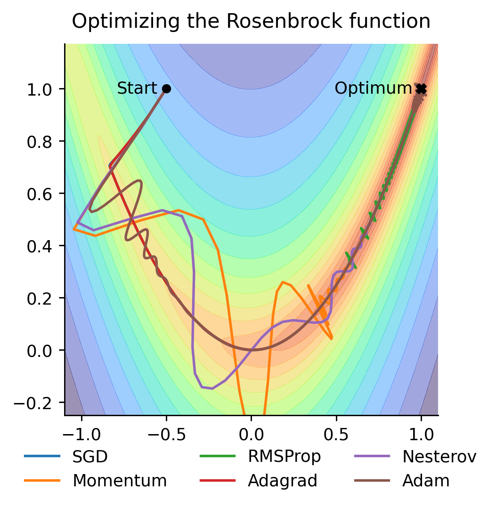
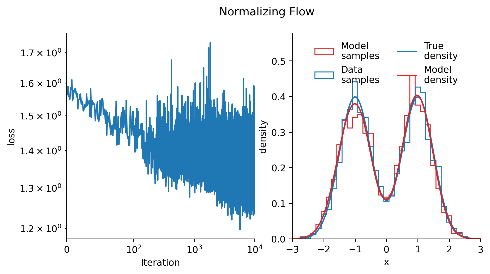

# Introduction

Generative modeling represents a fundamental paradigm in machine learning that aims to learn the underlying probability distribution of observed data to generate new samples with similar statistical properties. Formally, given a dataset $\mathcal{D} = \{x_i\}_{i=1}^N$ where $x_i \sim p_{\text{data}}(x)$ are independent and identically distributed samples from an unknown true data distribution $p_{\text{data}}: \mathcal{X} \rightarrow \mathbb{R}^+$, the objective is to approximate $p_{\text{data}}$ with a model distribution $p_{\theta}$ parameterized by $\theta \in \Theta$, where $\Theta$ is called the parameter space.

The quality of a generative model is typically assessed by its ability to: (1) generate individual samples that are indistinguishable from real data, (2) generate diverse samples with similar statistical properties, (3) provide efficient sampling procedures, and if applicable (4) accurately estimate the likelihood of new samples. These objectives often present competing demands, leading to various approaches with different trade-offs.

Traditional generative modeling techniques such as mixture models and hidden Markov models have been well-studied in statistical literature. However, the advent of modern machine learning techniques has revolutionized this field by enabling more flexible and expressive models capable of capturing complex data distributions. Modern deep generative models leverage neural networks as function approximators to parameterize complex transformations or probability distributions.

# Motivation

The pursuit of generative modeling is motivated by several key scientific and practical considerations. Understanding how to model complex probability distributions lies at the heart of statistical learning theory and connects deeply to fundamental questions in information theory, statistical physics, and computational neuroscience. From a practical perspective, generative models serve numerous important functions:

**Data synthesis**: Generating synthetic data that preserves the statistical properties of real data is valuable when real data is scarce, expensive to collect, or subject to privacy concerns. In healthcare, finance, and other sensitive domains, synthetic data generation enables analytics and algorithm development without exposing protected information.

**Representation learning**: The process of learning to generate data often requires models to discover compact, meaningful representations of high-dimensional data. These learned representations frequently capture semantically meaningful features that can be transferred to downstream tasks. Generative models are particularly effective at this, as they can be directly applied large datasets without the supervision of human-annotated labels.

**Scientific discovery**: By learning the distribution of existing data (e.g., protein structures, molecular configurations, astronomical observations), generative models can suggest novel configurations with desired properties, accelerating discovery in fields like drug design or materials science.

**Compression**: Understanding the structure of data distributions enables more efficient encoding and storage of information. By identifying regularities in data, compression algorithms can assign fewer bits to common patterns and more bits to rare features. Generative models can fill in the discarded parts of compressed data, with realistic patterns that are perceptually equivalent to the original data.

**Distribution estimation**: Many statistical inference problems require estimating probability densities from samples. Generative modeling provides flexible approaches to density estimation beyond traditional parametric methods. These density estimators can be used for tasks such as anomaly detection, where the goal is to identify data points that deviate from the expected distribution.

**Simulation**: In domains where running physical experiments is costly, generative models trained on existing data can serve as efficient simulators for counterfactual reasoning and scenario exploration. This is particularly useful if there is a combinatorial explosion in the number of necessary experiments, in such cases generative models may generalize to adjacent, unseen configurations and thus decrease the number of experiments required.

**Inverse problems**: Generative models excel at recovering original signals from corrupted or incomplete measurements—a challenge known as inverse problems. By learning what typical uncorrupted data looks like, these models can reconstruct missing information with remarkable accuracy. Applications include removing noise from photos, enhancing image resolution, filling in missing parts of signals, and reconstructing medical images from limited scan data. This capability represents a significant improvement over traditional techniques, particularly when dealing with complex real-world data.

# Function Approximation
Functions are mappings between two sets which have a fixed output for each input. This problem is conceptually simpler when compared to generative modeling, as it is deterministic, performance is straighforward to assess and it stays at the level of individual points, not distributions. Function approximation will later be used as the core building block for generative modeling.

### Definition 1 (Function Approximation)
Let $(X, \Sigma_X)$ and $(Y, \Sigma_Y)$ be metric measurable spaces, and consider a function $f: X \rightarrow Y$ and a parameterized family of functions $\mathcal{F} = \{f_\theta: X \rightarrow Y \mid \theta \in \Theta\}$, where $\Theta$ is the parameter space. The function approximation problem is to find parameters $\theta^* \in \Theta$ such that $f_{\theta^*}$ is "close" to $f$ according to some distance metric $d: Y^X \times Y^X \rightarrow \mathbb{R}^+$.
$$
f_{\theta^*} = \arg\min_{\theta \in \Theta} d(f, f_\theta)
$$
Note that the minimum does not necessarily exist, and even if it does, it might not be unique. In practice, we often settle for a suboptimal solution, or a solution that is close to the minimum, i.e. identifying a close to optimal solution for some $\varepsilon > 0$ is considered a success
$$
d(f, f_{\theta^*}) \leq \inf_{\theta \in \Theta} d(f, f_\theta) + \varepsilon\,.
$$

### Definition 2 (Approximation Error)
The approximation error $d(f, f_{\theta^*}) = d(f, f_{\theta^*})$, denoting a measure of how close $f_{\theta^*}$ is to $f$, may be defined in different ways depending on the problem at hand. Here are some relevant examples:
$$
\begin{aligned}
d_{\infty}(f, g) &= \sup_{x \in X} |f(x) - g(x)| \\
d_p(f, g) &= \left(\int_X |f(x) - g(x)|^p \text{d}\mu(x)\right)^{1/p} \\
\end{aligned}
$$
where $\mu$ is a (probability measure on $X$. The first distance is the uniform distance, which is the maximum difference between the two functions over the domain $X$. The second $L_p$ distance is integrated with respect to a probability measure, so two functions may be different on sets of small measure without contributing much to the total distance.

### Definition 3 (Universal Approximation)
A family of functions $\mathcal{F}$ is said to be universal if for any function $f: X \rightarrow Y$ and any $\varepsilon > 0$, there exists a function $f_\theta \in \mathcal{F}$ such that $d(f, f_\theta) < \varepsilon$. Some example of universal families of functions are:
- Piecewise linear functions on a grid are universal for the both the uniform and the $L_p$ distances.
- Neural networks with a single hidden layer are universal for the $L_p$ distance and uniform on compact sets.

## Neural Networks

Neural networks form the backbone of modern deep learning approaches to generative modeling. At their core, they are parametric function approximators inspired by biological neural systems, capable of expressing complex, non-linear mappings between finite-dimensional vector spaces.

### Definition 4 (Neural Network)
A feedforward neural network with $L$ layers is a composition of functions $f_{\theta} = f^{(L)}_{\theta_L} \circ f^{(L-1)}_{\theta_{L-1}} \circ \cdots \circ f^{(1)}_{\theta_1}$, where each $f^{(l)}_{\theta_l}: \mathbb{R}^{n_{l-1}} \rightarrow \mathbb{R}^{n_l}$ is a layer parameterized by $\theta_l$, mapping from $n_{l-1}$-dimensional space to $n_l$-dimensional space. The family of all possible neural networks $\mathcal{F}_{\text{NN}} = \{f_{\theta} \mid \theta \in \Theta\}$ can then be indexed by the parameters $\theta = (\theta_1, \theta_2, \cdots, \theta_L) \in \Theta = \mathbb{R}^{n_1 \times n_2} \times \mathbb{R}^{n_2 \times n_3} \times \cdots \times \mathbb{R}^{n_{L-1} \times n_L}$. The most common form of neural network layer is the fully connected (or dense) layer, defined as:
$$
f^{(l)}_{\theta_l}(x) = \sigma(W^{(l)} x + b^{(l)})\,,
$$
where $\theta_l = \{W^{(l)}, b^{(l)}\}$ consists of a weight matrix $W^{(l)} \in \mathbb{R}^{n_l \times n_{l-1}}$ and a bias vector $b^{(l)} \in \mathbb{R}^{n_l}$. The function $\sigma: \mathbb{R} \rightarrow \mathbb{R}$ is a non-linear activation function applied element-wise. A common and simple choice for the activation function is the ReLU function, defined as:
$$
\text{ReLU}(x) = \max(0, x)\,.
$$
However many similar functions can be used as activation functions as long as they are non-linear and differentiable almost everywhere, a modern example is the GELU function, which is defines as $GELU(x) = x \cdot \Phi(x)$, where $\Phi$ is the cumulative distribution function of the standard normal distribution. Which functions perform better is theoretically not well understood, so it is largely an empirical question, as is the choice of the number of layers and the number of neurons in each layer.

### Expressivity and Universal Approximation

The theoretical foundation for using neural networks as function approximators is provided by the Universal Approximation Theorem, which states that a feedforward network with a single hidden layer containing a finite number of neurons can approximate any continuous function on compact subsets of $\mathbb{R}^n$, under mild assumptions about the activation function.

More formally, for any continuous function $f: [0,1]^n \rightarrow \mathbb{R}$ and any $\varepsilon > 0$, there exists a single-layer neural network $f_\theta$ such that:

$$\sup_{x \in [0,1]^n} |f(x) - f_\theta(x)| < \varepsilon$$

In practice, deeper networks (those with more layers) have been found to be more parameter-efficient and easier to train for approximating highly complex functions, leading to the development of deep learning. The depth of a neural network provides a hierarchical representation learning capability, where each layer can learn progressively more abstract features of the input data.

While the simple feedforward architecture is flexible enough to be able to approximate most real-world relevant functions, the setup of modern neural networks is typically more complex to adress a range of practical concerns to ease the process of finding suitable parameters, since the vector space $\Theta=\mathbb{R}^n$ is typically very high-dimensional (in the order of millions to trillions of dimensions) and the set of optimal parameters is typically an algebraic variety of much lower, not well known number of dimensions.

## Optimizers

Neural networks are typically trained through gradient-based optimization methods that minimize a loss function $\mathcal{L}(\theta)$, which measures the discrepancy between the network's output and desired output. The parameters $\theta$ are iteratively updated using the gradient information of the loss function on a batch of data.
$$
\nabla_\theta \mathcal{L}(\theta) = \nabla_\theta \sum_{i=1}^N \mathcal{L}(x_i, f_\theta(x_i))\,,
$$
where $\mathcal{L}$ is a loss function, $x_i$ are samples from the dataset and $f_\theta$ is the neural network parameterized by $\theta$.

#### Stochastic Gradient Descent (SGD)

Stochastic Gradient Descent uses the gradient on the batch of samples to approximate the full gradient descent update, which takes steps in the direction of the negative gradient, i.e. the direction of steepest descent given by a linear approximation of the loss function
$$
\theta_{t+1} = \theta_t - \eta \nabla_\theta \mathcal{L}(\theta_t)
$$
This makes each iteration much faster than full gradient descent and introduces noise that can help escape shallow local minima. The gradient is scaled by the learning rate $\eta$ and the update is applied to the parameters $\theta$. SGD is guaranteed to converge to a local minimum of the loss function under certain conditions, such as when the loss function is convex and the learning rate goes sufficiently slow to zero.

#### Momentum-Based Methods

Momentum methods incorporate information from past gradients to accelerate convergence, particularly in regions where the gradient is small but consistent in direction:

**Classical Momentum:**
$$
\begin{aligned}
v_{t+1} &= \gamma v_t + \eta \nabla_\theta \mathcal{L}(\theta_t) \\
\theta_{t+1} &= \theta_t - v_{t+1}
\end{aligned}
$$
where $\gamma \in [0, 1)$ is the momentum coefficient controlling how much past gradients influence the current update.

**Nesterov Accelerated Gradient (NAG):**
$$
\begin{aligned}
v_{t+1} &= \gamma v_t + \eta \nabla_\theta \mathcal{L}(\theta_t - \gamma v_t) \\
\theta_{t+1} &= \theta_t - v_{t+1}
\end{aligned}
$$
NAG computes the gradient at the "lookahead" position $\theta_t - \gamma v_t$, providing a more accurate update direction.

### Adaptive Methods

Adaptive methods adjust the learning rate for each parameter based on the history of gradients, addressing the challenge of selecting appropriate learning rates.

**Adam** (Adaptive Moment Estimation) combines momentum with adaptive learning rates by maintaining exponentially decaying averages of both past gradients and squared gradients:
$$
\begin{aligned}
m_t &= \beta_1 m_{t-1} + (1 - \beta_1) \nabla_\theta \mathcal{L}(\theta_t) \\
v_t &= \beta_2 v_{t-1} + (1 - \beta_2) (\nabla_\theta \mathcal{L}(\theta_t))^2 \\
\hat{m}_t &= \frac{m_t}{1 - \beta_1^t} \\
\hat{v}_t &= \frac{v_t}{1 - \beta_2^t} \\
\theta_{t+1} &= \theta_t - \frac{\eta}{\sqrt{\hat{v}_t} + \epsilon} \hat{m}_t
\end{aligned}
$$
where $\beta_1, \beta_2 \in [0, 1)$ are decay rates for the moment estimates, and $\hat{m}_t, \hat{v}_t$ are bias-corrected estimates. Adam is widely used due to its robust performance across various deep learning tasks. Adam has become the standard optimizer for training neural networks, because of its empirically good final performance and convergence speed.

### Example: Optimizing of the Rosenbrock Function
The Rosenbrock function is a well-known test function in optimization, because of it is highly non-convex and has a narrow, parabolic valley. It is defined as
$$
f(x, y) = (1 - x)^2 + 100 (y - x^2)^2\,.
$$
Figure 1 shows the Rosenbrock function and the optimization trajectories of different optimizers.
All optimizers may theoretically converge to the global minimum at $(1,1)$ in this example, but the convergence speed of the different optimizers is drastically different. While SGD and the simple adaptive methods like RMSProp and AdaGrad move directly into the valley and then takes small steps to converge, the momentum based methods can overshoot the valley and take larger steps while oscillating in the direction of the optimum. Adam is able to take large steps, but also minimize the ammount of oscillation and thus converges faster than the other methods.

# Generative Modeling
Given a finite set of sample from an unknown joint probability distribution $p_{\text{data}}$ on a metric measurable space $\mathcal{X}$, the goal of generative modeling is to learn a parameterizable model $p_\theta$ that matches the true data distribution. This model does not necessarily need to be efficient at evaluating the probability of a given sample, it may also come in the form of a sampling procedure that can generate new samples from the model distribution. These models are called implicit as opposed to explicit generative models.

## Normalizing Flows
Normalizing flows are a class of generative models which consist of a prior distribution $p_Z$ on $\mathcal{X}$ with known density and sampler, and a parameterized bijective transformation $f_\theta: \mathcal{X} \rightarrow \mathcal{X}$ with known inverse $f_\theta^{-1}$. The model distribution is then given by the pushforward of the prior distribution under the transformation. Its density is given by the density transformation theorem, i.e.
$$
p_\theta(x) = p_Z(f_\theta^{-1}(x)) \cdot \left| \det \text{J} f_\theta^{-1}(x) \right|\,.
$$
If this expression and its gradient is tractable, the log likelihood of the data under the model distribution can be computed and optimized using gradient descent
$$
\mathcal{L}(\theta) = \mathbb{E}_{x \sim p_{\text{data}}} \left[ \log p_\theta(x) \right]\,.
$$
Calculating the determinant of the Jacobian matrix is not an obstacle in one dimension, but it becomes a computational burden in higher dimensions, unless the Jacobian matrix is triangular. For this reason, $f_\theta$ is typically chosen to be a product of simpler transformations, whose are triangular.

### Example: Normalizing Flow 1D
The difficult part of specifying the possible transformations $f_\theta$ is typically however that the function is invertible for any $\theta$. In one dimension all strictly monotonic functions are invertible on their range. Ensuring that the output of a neural network is positive can be done by applying a positive activation function in the output layer. Integrating this function will then yield a strictly monotonic function.
$$
f_\theta(x) = \int_{0}^x \underbrace{\log\left(1 + \exp(g_\theta(t))\right)}_{>\,0} \,\text{d}t + c\,,
$$
where $g_\theta$ is a neural network and $c$ is a learnable constant. If $x<0$ the function is integrated from $x$ to $0$ and if $x>0$ the function is integrated from $0$ to $x$. The integration is performed numerically and the gradient can be computed using a standard automatic differentiation package.

### Maximum Mean Discrepancy
Maximum Mean Discrepancy is a method for estimating the distance between two probability distributions. For a positive definite kernel $k: \mathcal{X} \times \mathcal{X} \rightarrow \mathbb{R}$, i.e. where the matrix $K = [k(x_i, x_j)]$ is positive semidefinite for any finite set of points $\{x_1, \ldots, x_n\} \subset \mathcal{X}$, the MMD between two distributions $p$ and $q$ is defined as
$$
\begin{aligned}
\text{MMD}(p, q) &=\mathbb{E}_{x,x' \sim p}[k(x,x')] \\
&- 2\cdot\mathbb{E}_{x \sim p, y \sim q}[k(x,y)] \\
&+ \mathbb{E}_{y,y' \sim q}[k(y,y')]
\end{aligned}
$$
The kernel is called _characteristic_ if the MMD is non-zero if and only if $p \neq q$. The kernel also has to be integrable for the MMD to be finite. One such kernel is the Gaussian radial basis function kernel, defined for some bandwidth parameter $\sigma > 0$ as
$$
k(x, y) = \exp\left(-\frac{\|x - y\|^2}{2\sigma^2}\right)\,.
$$
While the MMD is a very noisy estimator of the distance between two distributions from a finite sample in high numbers dimensions (> 10), it may still be used to train a simple implicit generative model in low dimensions, by simply minimizing the MMD for the pushforward of a neural network $f_\theta$ on a known prior distribution $p_Z$, i.e. $p_\theta = p_{Z\#f_\theta}$ with the loss function
$$
\mathcal{L}(\theta) = \text{MMD}(p_{\text{data}}, p_\theta)\,.
$$

## Generative Adversarial Networks
Generative Adversarial Networks (GANs) are a another class of implicitgenerative models. They consist of a generator network $G_\theta$ and a discriminator network $D_\vartheta$. The generator network maps a latent variable $z$ sampled from a prior distribution $p_Z$ to the data space $\mathcal{X}$, i.e. $G_\theta: \mathcal{Z} \rightarrow \mathcal{X}$. The discriminator network maps a sample $x$ to a scalar score $D_\vartheta: \mathcal{X} \rightarrow \mathbb{R}$.

The discriminator network is optimized to distinguish between samples from the model distribution and the data distribution, while the generator network is optimized to generate samples that give a high "realness" score to the discriminator network. This can be formalized as a minimax game between the two networks
$$
\min_\theta \max_\vartheta \mathbb{E}_{x \sim p_{\text{data}}}[ \log D_\vartheta(x) ] + \mathbb{E}_{z \sim p_Z}[ \log (1 - D_\vartheta(G_\theta(z))) ]\,.
$$
The minimax solution is searched for by using alternating gradient based optimization on the generator and discriminator networks. The above formulation based on binary cross entropy loss however typically leads to unstable training dynamics and a generator that collapses to a single or few points.

To alleviate this the Wasserstein GAN (WGAN) has been proposed. In the WGAN loss the discriminator outputs get get optimized linearly, but additionaly the gradient of the discriminator network gets penalized to ensure that the discriminator function is Lipschitz continuous.
$$
\begin{aligned}
\min_\theta \max_\vartheta &\ \mathbb{E}_{x \sim p_{\text{data}}}[ D_\vartheta(x) ] - \mathbb{E}_{z \sim p_Z}[ D_\vartheta(G_\theta(z)) ] \\
&+ \lambda \cdot \mathbb{E}_{x \sim p_{\text{data}}}[ \|\nabla_{x} D_\vartheta(x)\| - 1 ]^2\,,
\end{aligned}
$$
where $\lambda>0$ is hyperparameter for the strength of the penalty. A wide range of slight variations of the WGAN gradient penalty have been proposed with the goal of finding the most stable training configuration. A common and robust choice is to apply the gradient penalty on both the real and generated samples and to directly minimize the square of the gradient without the offset of $1$
$$
\mathbb{E}_{x \sim p_{\text{data}}}[ \|\nabla_{x} D_\vartheta(x)\|^2 ] + \mathbb{E}_{z \sim p_Z}[ \|\nabla_{G_\theta(z)} D_\vartheta(G_\theta(z))\|^2 ]\,.
$$

## Score Matching and Diffusion Models
Learning the density of a distribution directly is typically intractable without invertibility of the transformation, because estimating the normalization constant of a model distribution is intractable, i.e.
$$
p_\theta(x) = \frac{1}{Z_\theta} \cdot \exp\left(-f_\theta(x)\right)\,,
$$
where $f_\theta: \mathcal{X} \rightarrow \mathbb{R}$ is a parameterized function, like a neural network. Score matching sidesteps this problem by estimating the Stein score function, which is defined as
$$
\nabla_x \log p_\text{data}(x)\,.
$$
Using a MC algorithm like Langevin dynamics, samples from the underlying distribution can be recovered from the score function alone. However this might take thousands to millions of iterations. Even though there is no ground truth access to the score function, the squered difference between the true score function and the estimated score function, also called the Fisher divergence, can be rearranged by partial integration to
$$
\begin{aligned}
D_{F}(p_\text{data}, p_\theta) &= \frac{1}{2} \mathbb{E}_{x \sim p_{\text{data}}}[ \|\nabla_x \log p_\text{data}(x) - \nabla_x \log p_\theta(x)\|_2^2 ] \\
&= \mathbb{E}_{x \sim p_{\text{data}}}\left[\operatorname{tr}(\text{J}_x s_\theta(x)) + \frac{1}{2} \|s_\theta(x)\|_2^2\right]+c\,,
\end{aligned}
$$
for some constant $c$ independent of $\theta$. The Fisher divergence is then minimized by minimizing the trace of the Jacobian of the score function and the squared norm of the score function itself. The Jacobian of the score function however is prohibitively expensive to compute. While there are more efficient unbiased estimators for the Fisher divergence using random projections of the Jacobian, a more efficient approach is to approximate the Stein score using the connection to denoisers that Tweedies formula provides. Define $\tilde{x} = x + \sigma z$ for $x\sim p_{\text{data}}$ and $z\sim \mathcal{N}(0, I)$ independently, then
$$
\nabla_x \log p_{\tilde{x}}(x) = \frac{x - \mathbb{E}[x\mid\tilde{x}]}{\sigma^2}
$$
which can be translated into the following score matching objective function, by using the fact that the conditional expectation is the fucntion that minimizes the square error between the predicted and the true value, given the conditioning variable, i.e.
$$
\mathcal{L}(\theta) = \mathbb{E}_{x \sim p_{\text{data}}}\left[\left\|s_\theta(x) - \frac{x -\tilde{x}}{\sigma^2}\right\|_2^2\right]\,.
$$
This objective is efficient to compute and optimize $\sigma>0$. The minimum is achieved by the Stein score of the distribution of the noisy samples $\tilde{x}$, i.e. this method will introduce bias into the final model in the form additive normal noise with standard deviation $\sigma$, for this reason it makes sense to choose $\sigma$ as small as possible.

Choosing a small $\sigma$ however also means, that score function will be less accurate, since the training process will not include examples over the whole domain of inputs. This is especially problematic given that Langevin dynamics relies on the score function to be accurate everywhere, since no choosing good initial conditions for the Langevin dynamics is similarly hard to the general generative modeling problem.

This can be solves in an elegant way by learning the score function at multiple noise levels at once, i.e. by parametrizing the score function with the noise level as additional input $s_\theta(x, \sigma)$. The sampling process can then be initialized with standard normal noise and a high noise level, which is then gradually decreased to a low noise level during the sampling process. This makes sure that at each noise level the initial condition of Langevin dynamics is close to the data distribution at the given noise level already and minimize the volume where the model needs to have an accurate estimate of the score function but no close examples were sampled during the optimization process.

When considering the limit to infinetly many noise levels and langevin dynamics steps, the sampling process will converge to a stochastic differential equation, which has an interesting interpretation as reverse diffusion process. The forward diffusion process has the data distribution as initial condition and iteratively adds gaussian noise to the data, datapoints are analogous to molecules, which diffuse in a medium, until their position contains no information aboout the initial position.
$$
\text{d}x = f(x, t)\,\text{d}t + g(t)\,\text{d}W\,,
$$
where $f$ is the deterministic drift and $g$ is the strength of the diffusion over time. If $g$ large and $f$ is negative the final datapoint will be indistinguishable normal noise, i.e. the final distribution will be a standard normal distribution. The reverse of this process is given by another stochastic differential equation, integrated backwards in time, which involves the Stein score of the distribution at each time step, i.e.
$$
\text{d}x = \left(f(x, t) - g^{2}(t)\nabla_x \log p_t(x)\right)\text{d}t + g(t)\,\text{d}W\,,
$$
where $p_t(x)$ is the distribution of the forward process at time $t$. It is notable, that both of these processes induce the same time marginal distributions $p_t(x)$ for all $t\in[0,1]$. Another interesting oberservation is that the following ordinary differential equation also shares the same time marginal distributions
$$
\text{d}x = \left(f(x, t) - \frac{1}{2} g^{2}(t)\nabla_x \log p_t(x)\right)\text{d}t\,.
$$

## References
::: {#refs}
:::

## Acknowledgements
